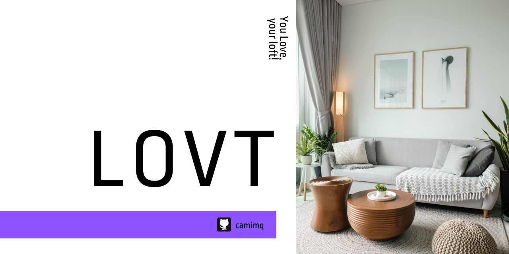

<i> Projeto LOVT para testar responsividade </i> 

 
 

 

## About the project

LOVT - You Love, your loft, is a simple project to test responsiveness, using basic concepts learnt, and begin to understand `media queries` and its implication throughout the project´s execution.

As breakpoint´s constraints, I´ve considered those available at DevTool on Google Chrome:

- `max-width: 320px`
- `max-width: 375px`
- `max-width: 425px`
- `max-width: 768px`
- `max-width: 1024px`
- `max-width: 1440px`

To develop this page I´ve used pure **HTML** e **CSS** and had this [Figma file](https://www.figma.com/file/sx1wvTbw3k8w31YYBfmdZp/Exercicio01?node-id=0%3A1) as reference.

 

### Demo page

You can access the page on [GitHub Pages](https://camimq.github.io/lovt/).